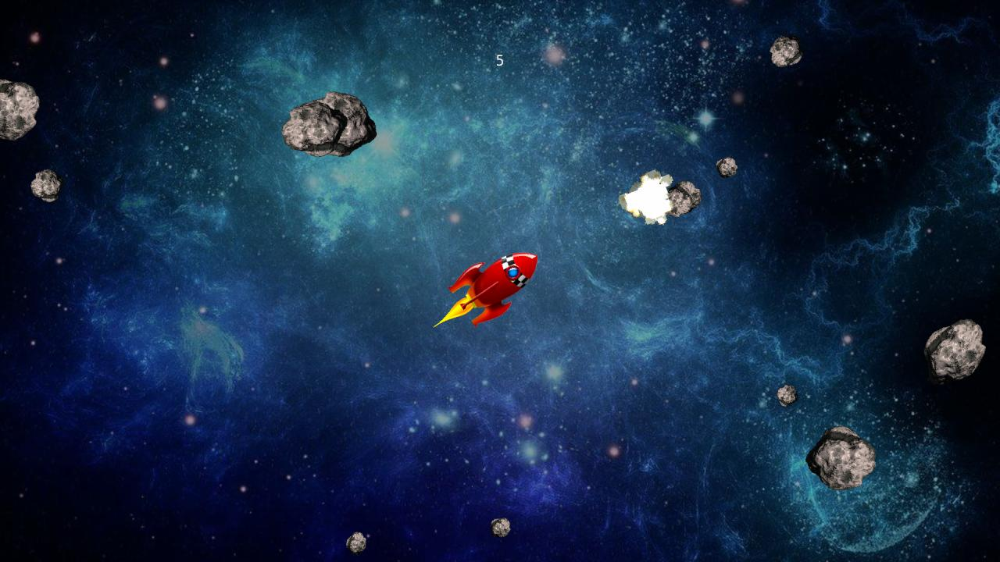

# BrighterScript Game Engine

An object-oriented game engine **and 2D/3D drawing library** for Roku, written in [BrighterScript](https://github.com/rokucommunity/brighterscript).

Build a full game with entities, rooms, collisions, input, and UI - or just pull in the renderer to draw sprites, shapes, billboards, and wireframe/solid 3D models on top of your own Roku app. Same engine, use as much or as little of it as you need.



<!--
  Add remaining screenshots here once available, e.g.:
  
  
-->

## Why BrighterScript Game Engine?

- **Object-oriented, like the engines you already know.** `GameEntity`, `Room`, and lifecycle hooks (`onCreate`, `onUpdate`, `onCollision`, `onDrawBegin`/`onDrawEnd`, ...) give you the same shape as Phaser, HaxeFlixel, GameMaker, or Unity - minus the visual editor.
- **A real 2D/3D renderer, not just sprite blitting.** Draw images, sprites, animations, shapes, text, and billboards, or render actual 3D models (loaded from `.stl`) with wireframe, solid, and shaded draw modes - all built on Roku's `roCompositor`/`Draw2D`, so it runs on real hardware.
- **Built-in collisions, input, UI, and debug tooling.** Circle/rectangle colliders, a retained-mode UI widget tree, and debug overlays (FPS, colliders, memory, GC stats) come standard, so you're not rebuilding the basics for every project.
- **Use only what you need.** The `Renderer`/`Canvas` layer works standalone if you just want a capable drawing library for an existing Roku app, without adopting the full game loop.
- **Develop without a physical Roku.** This engine supports running under the [BrightScript Simulator](https://github.com/lvcabral/brs-desktop), Marcelo Lv Cabral's desktop BrightScript simulator, so you can iterate on your game without deploying to hardware every time.

## A quick taste

```brightscript
sub main()
  game = new BGE.Game(1280, 720)
  game.fitCanvasToScreen()
  game.loadBitmap("player", "pkg:/sprites/player.png")

  room = new MainRoom(game)
  game.defineRoom(room)
  game.changeRoom(room.name)

  game.play()
end sub
```

```brightscript
class MainRoom extends BGE.Room

  sub new(game as BGE.Game)
    super(game)
    m.name = "MainRoom"
  end sub

  override sub onCreate(args as roAssociativeArray)
    m.game.addEntity(new Player(m.game))
  end sub

end class
```

```brightscript
class Player extends BGE.GameEntity

  sub new(game as BGE.Game)
    super(game)
    m.name = "Player"
  end sub

  override sub onCreate(args as roAssociativeArray)
    m.position = m.game.canvas.renderer.getCanvasCenter()
    bitmap = m.game.getBitmap("player")
    region = CreateObject("roRegion", bitmap, 0, 0, bitmap.GetWidth(), bitmap.GetHeight())
    m.addImage("sprite", region)
    m.addCircleCollider("body", bitmap.GetWidth() / 2)
  end sub

  override sub onInput(input as BGE.GameInput)
    m.velocity.x = input.x * 10
    m.velocity.y = input.y * 10
  end sub

  override sub onCollision(myCollider as BGE.Collider, otherCollider as BGE.Collider, otherEntity as BGE.GameEntity)
    m.game.postGameEvent("player_hit", {by: otherEntity})
  end sub

end class
```

This exact code lives in [`examples/quickstart`](examples/quickstart) as a runnable app. See the [Documentation](https://markwpearce.github.io/brighterscript-game-engine) for the full API, and the examples below for complete, runnable projects.

## Examples

The `examples/` directory has full Roku channels you can build and run:

| Example | What it shows |
| --- | --- |
| [`quickstart`](examples/quickstart) | The minimal `MainRoom`/`Player` example from above, as a runnable app |
| [`asteroids`](examples/asteroids) | A complete 2D game - player movement, bullets, collisions, particle-style explosions, sound |
| [`pong`](examples/pong) | Classic 2D Pong, playable in both 2D and 3D camera modes |
| [`snake`](examples/snake) | Grid-based movement and growing collision shapes, in 2D and 3D |
| [`3d`](examples/3d) | Loading and rendering `.stl` 3D models with the pseudo-3D renderer |
| [`pixels`](examples/pixels) | A tour of drawables - polygons, rectangles, sprites, and more, one room per shape |
| [`canvas`](examples/canvas) | Using the engine's canvas/renderer as a standalone drawing surface |
| [`hybrid`](examples/hybrid) | Mixing this engine's Draw2D-based rendering with a SceneGraph app |
| [`rendererTest`](examples/rendererTest) | A manual test harness used while developing the renderer itself |

Scaffold a new example (manifest, icons/splash, `package.json`, a minimal `MainRoom`) with:

```
npm run create-example -- <name> ["Display Title"]
```

## Cloning and Running Examples

The BrighterScript Game Engine public repository is on [Github](https://github.com/markwpearce/brighterscript-game-engine/)

Clone the project:

```
git clone https://github.com/markwpearce/brighterscript-game-engine.git
```

This project includes various example Roku apps in the `examples` directory. To run them, you will need a Roku and have it set up properly for doing development. See: https://developer.roku.com/en-ca/docs/developer-program/getting-started/developer-setup.md.

To run the examples:

Install dependencies:

```
cd brighterscript-game-engine
npm install
```

You will need to set up each project in the examples directories. You can do this by using this script:

```
npm run prepare-examples
```

### Build from the command line:

You can manually build the examples from the command line and manually add the zip files to your Roku:

```
npm run build-examples
```

The above command will generate example .zip files like `./examples/asteroids/out/bge-asteroids.zip`

### Open the Workspace in VS Code:

We recommend you install the great [Brightscript Language VSCode Extension](https://marketplace.visualstudio.com/items?itemName=RokuCommunity.brightscript).

Create/edit a `.env` file to specify the details for you target Roku device:

```env
ROKU_USERNAME=<roku development username - default is rokudev>
ROKU_PASSWORD=<roku development password>
ROKU_HOST=<local IP address of the target roku>
```

Then simply run one of the Debug configurations from the Debug tab.

## Installation

_NOTE - Not available yet from ropm!_

Use ropm:

```
ropm install brighterscript-game-engine
```

Suggestion - use a shorter prefix (we use `bge` in the documentation):

```
ropm install bge@npm:brighterscript-game-engine
```

## Documentation

Documentation can be found [here](https://markwpearce.github.io/brighterscript-game-engine)

## Acknowledgements

This project was originally forked from [Roku-gameEngine](https://github.com/Romans-I-XVI/Roku-gameEngine) by Austin Sojka, and converted into BrighterScript. This work owes a lot to this original project!

Thanks also to:

- [RokuCommunity](https://github.com/rokucommunity) for [BrighterScript](https://github.com/rokucommunity/brighterscript), [bslint](https://github.com/rokucommunity/bslint), [roku-deploy](https://github.com/rokucommunity/roku-deploy), and the rest of the tooling that makes this project possible.
- [Marcelo Lv Cabral](https://github.com/lvcabral) for his work on the Roku/BrightScript community and tooling, including the [BrightScript Simulator](https://github.com/lvcabral/brs-desktop) this engine supports developing against.
