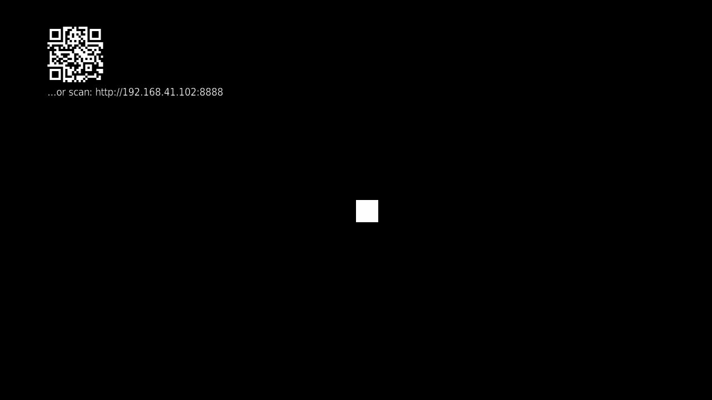

# Controller Input

A phone or tablet's browser can act as a twin-stick controller for your
channel - no app install, no SceneGraph, no second computer. The Roku
itself hosts a small web page; a player opens it in their browser over the
local network.

## Enabling it

```brighterscript
game.enableControllerInput()   ' starts the server on port 8888
```

Show the connection URL somewhere in your UI so a player knows what to
open:

```brighterscript
label.setText(game.getControllerConnectionInfo())
```

## Mapping input

`game.controls` (a `BGE.Controller.ControlMap`) is the only concept you
need: bind a logical action/axis name once, then read it every frame -
your game code never has to know whether the remote or a connected
controller produced the input.

```brighterscript
game.controls.bindAction("jump", "ok", "a")   ' name, remoteButton, controllerButton
game.controls.bindAxis("move")                ' defaults to the controller's stick "1"
```

`controllerButton`/the stick name are whatever the browser page sends - the built-in
page (see below) uses `"a"`/`"b"` for its two buttons and `"1"`/`"2"` for its two
sticks, but a custom page can send any name it likes (e.g. `"reload"`) and bind to
it with no engine change.

The recommended way to read bound state each frame is `onControls()`, a
`GameEntity` lifecycle hook called once per frame with the game's
`ControlMap` (the same object as `m.game.controls`):

```brighterscript
override sub onControls(controls as BGE.Controller.ControlMap)
  if controls.isActionPressed("jump") then ...
  move = controls.getAxis("move")   ' a BGE.Math.Vector
  m.velocity.x = move.x * speed
  m.velocity.y = move.y * speed
end sub
```

`onControls()` is only called on a frame where the game has bound at least
one action/axis (`ControlMap.hasBindings()`) - a game that never calls
`bindAction`/`bindAxis` never gets this callback at all, keeping the
zero-cost-when-unused guarantee. `isActionPressed`/`isActionReleased` read
true only on the frame the bound button was pressed/released, and
`isActionHeld` every frame in between.

You can still read `m.game.controls` directly from `onUpdate()` (or
anywhere else) instead, if you want different per-frame ordering or would
rather keep controller reads alongside your other update logic - the two
approaches read the exact same state, `onControls()` just saves the
`m.game.controls` boilerplate and guarantees the read happens before
`onUpdate()` runs:

```brighterscript
sub onUpdate(deltaTime as float)
  if m.game.controls.isActionPressed("jump") then ...
end sub
```

`bindAxis`'s axis falls back to the remote d-pad whenever the bound
controller stick reads neutral, so binding once supports both input
sources automatically.

## Multiple controllers

Each connected browser is assigned its own `playerIndex` (0, 1, 2, ...)
in the order it connects. Pass `playerIndex` to `bindAction`/`bindAxis`
to say which controller a binding listens to; a single-player game can
ignore it entirely (it defaults to 0).

```brighterscript
game.controls.bindAction("p2fire", invalid, "a", 1)   ' player 1's button "a"
game.controls.bindAxis("p2move", "1", 1)              ' player 1's stick "1"

if game.controls.isActionPressed("p2fire") then ...
```

Reading an action or axis never takes a `playerIndex` - each name is bound
to one player at bind time, so `isActionPressed("p2fire")`/`getAxis("p2move")`
already know which controller they refer to. Give each player's actions
their own names.

## Labels and the raw custom payload

`bindAction`/`bindAxis` take an optional trailing `label` - once a browser
connects, the server sends it `{playerIndex, labels}` (its assigned player
number plus a name -> label map for every labeled binding), so a custom
controller page can render meaningful text instead of raw names:

```brighterscript
game.controls.bindAction("jump", "ok", "a", 0, "Jump")
```

A custom on-screen control that isn't button/stick shaped (a slider, a
color picker, etc.) can send an arbitrary `custom` payload in its message;
read the latest one with `getCustomPayload()`:

```brighterscript
payload = game.controls.getCustomPayload()   ' the raw object, {} if none sent yet
```

## Advanced: raw controller input

Every controller button press also flows through the normal `onInput`
callback as a `BGE.GameInput`, with `playerIndex` set and `button` equal to
the raw name the browser sent. Most games won't need this - `ControlMap`
above is the intended way to consume controller input.

## Limitations

- The controller page loads a small library from a public CDN - the
  *player's phone* needs internet access for the on-screen sticks to
  render (the Roku itself needs none).
- Discovery is a plain LAN URL - draw it as a QR code with [`BGE.QrCode`](/qr-codes) instead of/alongside text so a player can scan rather than type it:

  

See `examples/controller` for a full runnable demo.
