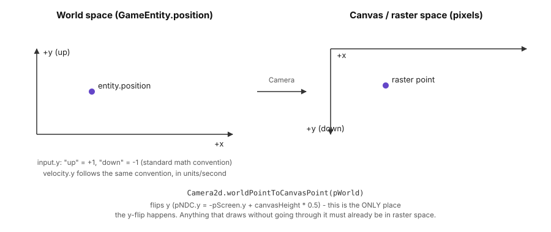
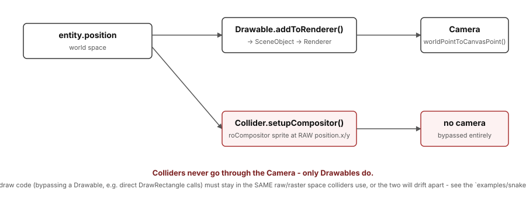

# Engine Internals

This is a deeper look at _how_ BGE implements the concepts covered in
[Building a Game with BGE](/game-engine-overview) - the coordinate systems in play, how drawing relates (and
doesn't relate) to collision, and how the renderer and collision system are actually built. Read
this when you're debugging something that doesn't behave the way the overview guide suggests it
should, or when you're writing code that draws directly to a `Renderer` instead of going through a
`Drawable`.

## Two coordinate spaces, and exactly one place they meet

`GameEntity.position` (and `velocity`, `rotation`) live in **world space**: standard math
convention, +y is up. `GameInput.onInput(input)` reports directional input in the same convention -
pressing "up" gives `y: 1`, "down" gives `y: -1`.

Everything a `roScreen`/`roBitmap`/`roCompositor` actually draws to is in **canvas/raster space**:
origin top-left, +y down, in pixels.



The flip between the two happens in exactly one place: `Camera.worldPointToCanvasPoint()`
(`Camera2d.bs` for the default 2D camera, `Camera3d.bs` for a perspective camera). Every
`Drawable` goes through this - which is _why_ it's safe for game code to think entirely in
"+y is up" world-space terms and never worry about the flip.

## Colliders never go through the camera

This is the one piece of the coordinate-space story that catches people who write custom draw
code: **`Collider` doesn't call the camera at all.**



`Collider.setupCompositor()`/`adjustCompositorObject()` place the collider's `roSprite` directly at
`entity.position.x`/`.y` (plus its `offset`) - no camera, no projection, no y-flip. This is a
deliberate simplification (collision math would be considerably more expensive if it had to
account for camera rotation/perspective every frame), but it means:

- For a `GameEntity` that only ever moves via `velocity`/`position` and only ever draws through a
  `Drawable` - which is how [Building a Game with BGE](/game-engine-overview) recommends
  building everything, and how every entity in `examples/asteroids` is built - this is invisible:
  the `Drawable` pipeline and the `Collider` pipeline agree because both start from the same
  `entity.position`, and the camera transform is a pure, order-preserving mapping from one
  consistent space to another. You get this guarantee for free; it's not something you have to
  reason about per entity.
- **Calling `Renderer.DrawRectangle()`/`DrawText()`/etc. directly - bypassing `Drawable` entirely -
  throws that guarantee away.** It's occasionally the right call (a HUD element, a debug overlay, a
  background grid with no collider of its own), but the moment that code's coordinates need to
  agree with a `Collider` anywhere in the same scene, direct drawing is the reason they might not:
  you're now responsible for keeping two independent draw paths in the same coordinate space by
  hand. Prefer a `Drawable` whenever what you're drawing has a collider, or could reasonably grow
  one later.

### Case study: `examples/snake`

`examples/snake` hit exactly this. `GridEntity.drawRectangleOnGrid()` (used by both `Snake` and
`Apple`) called `renderObj.worldPointToCanvasPoint()` before drawing, while `MainRoom.drawWalls()`
drew its wall rectangles directly with raw coordinates - and every collider in the scene (walls,
snake head, apple) was built from raw `entity.position`, with no camera involved. The example's
`main.bs` also had a `Camera3d` wired up (`use3d = true`, a leftover from an earlier "does this
work in 3D too?" experiment), so the mismatch was made worse by a full perspective projection
distorting where things rendered near the edges of the play field.

The fix had three independent parts, each worth recognizing as its own category of bug:

1. **Coordinate-space mismatch** - `GridEntity` was made to draw directly, the same way
   `drawWalls()` already did, removing the stray camera transform entirely. (The more idiomatic
   fix would be converting the grid squares to real `Drawable`s in the first place, so this class
   of bug can't recur - `examples/snake` predates that convention being written down and hasn't
   been rebuilt around it, but a new grid-based game would be better off starting there.)
2. **Collider-offset mismatch** - the snake head and apple are drawn top-left-anchored, but their
   colliders used `offset_y = 0` instead of `offset_y = grid` (see the offset explanation in
   [Building a Game with BGE](/game-engine-overview)), putting the collider a full cell
   away from the drawn square.
3. **Inverted input** - `Snake.onInput` set `yDirection = input.y` directly, but since `gridY`
   increases _downward_ on screen (no camera flip involved, per the above) while `input.y` follows
   the world-space "+y is up" convention, pressing "down" was moving the snake _up_. The fix was a
   one-line sign flip: `yDirection = -input.y`.

None of these three would have been caught by type-checking or `bslint` - they're all "the numbers
are individually valid, they just don't agree with each other" bugs, which is exactly what makes
coordinate-space mismatches worth understanding structurally rather than pattern-matching on.

## Renderer, SceneObjects, and draw modes

A `Renderer` doesn't draw `Drawable`s directly - a `Drawable.addToScene(renderer)` call registers a
`SceneObject` subclass, and the `Renderer` iterates those each frame, sorted back-to-front and
dispatched through a `SceneObjectDrawMode` that controls how each one reacts to camera
rotation/perspective (this is what gives a fundamentally 2D-raster engine its pseudo-3D/billboard
capability - see `examples/3d`). See [Drawables and SceneObjects](/drawables-and-scene-objects) for
the full per-type reference, the draw-mode table, a walkthrough of exactly how `Renderer.drawScene()`
processes a frame, and a deep dive on `SceneObjectPlane` (the ground-plane renderer used by
`examples/terrain`).

## Analog-stick cursor movement (`BGE.UI`)

`BGE.UI` focus is global: one `Game` owns one `BGE.UI.FocusManager` (`Game.focusManager`), and its
`navigationMode` is either `list` (the default - discrete next/previous stepping through registered
widgets) or `pointer` (an opt-in virtual cursor, `cursorPosition`, hit-tested against widget bounds
to drive hover/focus). In `pointer` mode, the cursor can also be driven continuously by a connected
controller's analog stick:

```brightscript
' once, at startup (see examples/ui/src/source/main.bs)
game.enableControllerInput()

' in the room that wants a cursor
game.controls.bindAxis("cursor", "1", 0) ' player 0's stick "1"
game.focusManager.navigationMode = BGE.UI.FocusNavigationMode.pointer
game.focusManager.analogAxisName = "cursor"
game.focusManager.cursorAnalogSpeed = 400.0 ' px/sec at full deflection (the default)
```

`analogAxisName` names an axis you bound through `Game.controls.bindAxis()` (see
`BGE.Controller.ControlMap`) - the UI layer adds no controller plumbing of its own, it just reads
that axis. It's `invalid` by default, so a game that never sets it gets exactly the previous
behavior at zero cost.

`FocusManager.updateAnalogCursor(controls, dt)` does the work, and unlike `FocusManager.update()`
(driven once per input event) it runs **every frame**, from `Game.processUiInput()` - continuous
analog movement can't wait for a discrete button event. It applies a `0.15` deadzone
(`BGE.UI.CURSOR_ANALOG_DEADZONE`) before moving anything; that deadzone is local to the UI cursor,
not applied inside `ControlMap`, so other axis consumers still see the raw stick value. The cursor is
clamped to the UI canvas, so a held stick can't push it off-screen.

One behavior to know about: `ControlMap.getAxis()` falls back to the remote's d-pad whenever the
bound stick reads neutral, which means d-pad presses already flow through `updateAnalogCursor()`'s
continuous model. So once `analogAxisName` is set, the older discrete `cursorStep` stepping in
`update()` is skipped entirely - otherwise one d-pad press would drive the cursor twice, through two
different movement models. A single d-pad tap consequently moves the cursor by one frame's worth of
`cursorAnalogSpeed` rather than a full `cursorStep`; leave `analogAxisName` unset if you want the
discrete stepping instead. If `analogAxisName` names an axis you forgot to actually pass to
`controls.bindAxis()`, `update()` detects that (`ControlMap.hasAxisBinding()`) and falls back to the
discrete stepper instead of leaving the cursor unresponsive.

### Widget background images: 9-patch and plain

`Theme.backgroundImage` replaces a widget's flat-color background fill with an image, either a
stretchable `BGE.UI.NinePatchImage` or a plain `BGE.UI.ImageBackground` - both share the same
`draw(renderer, x, y, width, height)` shape, so any widget with a themed background (`Button`,
`Checkbox`, `Slider`, `TextInput`, `Select`) accepts either one interchangeably. The easiest way to
load either is `BGE.UI.loadBackgroundImage(path)`, which picks the right type for you from the
filename:

```brightscript
' ".9.png" (case-insensitive) loads as a 9-patch; anything else loads as a plain image
m.game.defaultTheme.backgroundImage = BGE.UI.loadBackgroundImage("pkg:/images/panel.9.png")
m.game.defaultTheme.backgroundImage = BGE.UI.loadBackgroundImage("pkg:/images/button-background.png")
```

**`BGE.UI.NinePatchImage`** (also called "scale-9" - used extensively in Android UI frameworks): a
source bitmap is sliced into 9 regions at construction (4 fixed-size corners, 4 edges stretched along
one axis, and a center stretched both ways), so a small texture can back a widget background of any
size without visibly stretching its corners. Beyond `loadBackgroundImage()`, it can also be loaded or
constructed directly:

```brightscript
' Load from a packaged asset using Android's .9.png marker convention
m.game.defaultTheme.backgroundImage = BGE.UI.loadNinePatchImage("pkg:/images/panel.9.png")

' Or load from an already-loaded .9.png roBitmap
ninePatchBitmap = CreateObject("roBitmap", "pkg:/images/panel.9.png")
m.game.defaultTheme.backgroundImage = BGE.UI.parseNinePatchBitmap(ninePatchBitmap)

' Or construct manually if you know the insets (requires a plain image with no border/markers)
plainBitmap = CreateObject("roBitmap", "pkg:/images/button-background.png")
m.game.defaultTheme.backgroundImage = new BGE.UI.NinePatchImage(plainBitmap, 6, 6, 6, 6)
```

**Authoring a `.9.png` file:** Add a 1-pixel transparent border around your source image, then mark
the stretch region with solid black pixels (nearly black/opaque, to withstand PNG compression) on
the top row and left column - the marked run is the *stretchable* part of the image, so the unmarked
pixels either side of it become the fixed corner insets. Only pixels 1 through (length-2) of each
border are scanned; the very first and last pixel are reserved as corners and are never read as part
of a marker run. The border is discarded at load
time, so your visible content doesn't include it. This is the same convention Android UI uses - any
`.9.png` tool (including GIMP plugins) will prepare your asset correctly.

**`BGE.UI.ImageBackground`** is the plain-image counterpart: the whole source image is stretched to
fill the widget's bounds, corners included - no insets, no marker convention, just
`new BGE.UI.ImageBackground(bitmap)` (or `loadBackgroundImage()` for a path not ending in `.9.png`).
Use this for a background that's meant to stretch uniformly rather than keep unstretched corners.

`backgroundImage` is purely additive: it defaults to `invalid`, so existing flat-color `Theme`s are
unaffected. When it is set, the same image is used regardless of hover/focus state - a themeable
hovered/focused background image is a possible future follow-up, as is letting a `UiContainer` (not
just an individual widget) back itself with a background image. See `examples/ui/src/source/Rooms/NinePatchRoom.bs` for a working demo.

### Widget overlay rendering and popup Select

`UiWidget.drawOverlay(canvas as BGE.Canvas, theme as BGE.UI.Theme)` is a general-purpose hook that fires
once per frame for whichever widget currently has focus. The hook runs **after** the entire `gameUi` widget
tree has drawn, so overlay content always renders above every other widget regardless of container nesting
or z-order - this is the key property that makes floating overlays work without special `Game.bs` wiring to
manage render order.

By default, `UiWidget.drawOverlay()` is empty - most widgets don't need it. Override it if your widget needs
to draw content that must float above everything else on the UI layer:

```brightscript
class MyWidget extends BGE.UI.UiWidget
  override sub drawOverlay(canvas as BGE.Canvas, theme as BGE.UI.Theme)
    ' Draw floating content here - it composites after every other widget
  end sub
end class
```

`BGE.UI.Select` is a focusable option picker with two distinct interaction styles, controlled by its `style`
field (`BGE.UI.SelectStyle`):

**Inline style (default):** `Select.style = BGE.UI.SelectStyle.inline`
- Left/Right (while focused) cycle through the options with wraparound, changing the selected option in place
- The current selection displays inline within the widget itself
- No popup or overlay - a compact, space-efficient style matching the existing `Slider` widget's interaction pattern
- This is the original behavior; it's the default so existing code breaks nothing

**Popup style (opt-in):** `Select.style = BGE.UI.SelectStyle.popup`
- OK (while focused) expands an overlay list of every option, rendered below the Select widget
- While expanded, Up/Down move a visual highlight through the options (throttled to one step per `WIDGET_REPEAT_DELAY_MS`, matching inline cycling's throttle)
- OK again commits the highlighted option as the new selection (firing `onChanged()`) and collapses the list
- Back (while expanded) cancels without changing the selection and collapses the list
- Left/Right (inline cycling buttons) never change the selection in popup style - they're not part of the interaction model. While collapsed they have no effect at all (focus navigation handles them as usual); while expanded they're consumed and inert, so they neither move the highlight nor walk focus away from the open list
- Losing focus while expanded collapses the list (`onBlur()`), so a popup can't be left open-but-invisible with a stale highlight
- The popup list draws via `UiWidget.drawOverlay()`, so it floats above all other UI regardless of nesting

The popup list is an explicit non-goal: every option draws unclipped/unscrolled, and a list long enough to
overflow the canvas bottom (e.g., 100 options on a 720-pixel display) extends past the visible canvas. This
is a deliberate trade-off to keep the implementation simple and leave scrolling/virtualization as a
follow-up. See `examples/ui/src/source/Rooms/PopupSelectRoom.bs` for a working demo.

### Text entry via ECP keyboard

`BGE.UI.TextInput` is a focusable single-line text entry widget driven entirely by the platform's own
text-entry mechanism — no virtual keyboard is drawn by the engine. A player needs a connected Roku mobile
app (or equivalent remote-control extension supporting on-screen text input) to actually type; the local
game code receives individual characters through the standard `onECPKeyboard(char as integer)` dispatch,
the same mechanism that powers Roku's built-in `roKeyboardScreen` component.

```brightscript
textInput = new BGE.UI.TextInput(game)
textInput.placeholder = "Enter your name"
textInput.maxLength = 20
textInput.onChanged = sub(input as BGE.UI.TextInput)
  ' Fires after any character insertion or deletion
end sub
textInput.onSubmit = sub(input as BGE.UI.TextInput)
  ' Fires on OK press while focused
end sub
gameUi.addChild(textInput)
```

**Key properties:**

- `text` — Current text content (string). Modified by character entry and backspace; read via `getValue()`.
- `cursorIndex` — Caret position, `0..Len(text)`. Moved by Left/Right while focused (clamped to valid range).
- `maxLength` — Maximum text length; `0` means unlimited (default). Characters typed once `text.Len()` reaches
  `maxLength` are silently dropped.
- `placeholder` — Dimmed text shown when `text` is empty *and* the widget is unfocused; disappears on focus
  or once the player types anything.
- `onChanged()` — Callback fired after any edit (character inserted or deleted). Receives the `TextInput`
  itself as an argument so a closure can read the modified `text`/`cursorIndex`.
- `onSubmit()` — Callback fired on OK press while focused. Same callback signature as `onChanged()`.

**Text input from Roku mobile app:** When a player has the Roku mobile app open (or a comparable remote
extension that supports on-screen text entry), any character they type through the app's keyboard arrives
as an `onECPKeyboard()` call with that character's ASCII code. Printable characters (letters, digits,
punctuation) arrive as their normal ASCII values; the backspace/delete key is inferred to send ASCII 8
(the `BS` control character) and deletes the character immediately before the caret. **This backspace-is-char-8
assumption is unit-tested** (see `src/source/engine/ui/TextInput.spec.bs`, which directly calls
`onECPKeyboard(8)` to verify deletion), **but it is inferred from the existing ECP-keyboard plumbing rather
than tested against a real Roku mobile app's on-screen keyboard** — manual verification using an actual
Roku mobile app remains as future work to confirm whether the real app does indeed send char-8 for backspace.

Left/Right arrow keys (while focused) move the caret one position at a time, repeating after a brief delay
if held, matching the existing throttling pattern on `Slider` and `Select.popup` cycling.

Note that `TextInput` neither clips nor scrolls text wider than the widget — text longer than the field
simply draws past its right edge, a known limitation. Set `maxLength` to a value that fits for any field
with a known reasonable size.

See `examples/ui/src/source/Rooms/TextInputRoom.bs` for a working demo. ECP-delivered characters — as sent
by any client speaking the ECP protocol, including a real connected controller or companion app — are
verified end-to-end on real hardware by automated testing; the specific behavior of a real mobile app's
on-screen-keyboard backspace key has not been separately confirmed.

## Collision, concretely

Each `Collider` (`CircleCollider`, `RectangleCollider`) wraps one `roSprite` on the `Game`'s shared
`roCompositor`. Every frame, `Game.processEntitiesCollisions()` calls
`roCompositor.CheckMultipleCollisions()` per entity's colliders and dispatches `onCollision(myCollider,
otherCollider, otherEntity)` for every hit - there's no manual AABB/circle-intersection math
anywhere in engine code. `Collider.memberFlags`/`collidableFlags` are the same bitflags as
`ifSprite.SetMemberFlags`/`SetCollidableFlags` - two colliders only register a hit if their flags
intersect, which is how you'd implement, say, "bullets hit enemies but not other bullets."

## Garbage collection and entity lifecycle

`Game` runs BrightScript's garbage collector on a timer (`secondsBetweenGarbageCollection`, default
10s) rather than every frame, since running it every frame would be wasteful. `GameEntity.isValid()`
just checks whether `id` has been set to `invalid` - `Delete()`/`invalidate()` doesn't immediately
free anything, it marks the entity so the _next_ full pass skips it and the end-of-frame cleanup
removes it from `Game.Entities`/`sortedEntities`. This is why engine code re-checks
`isValidEntity()` after every callback (see the game loop diagram in
[Building a Game with BGE](/game-engine-overview)) instead of trusting that an entity is still there once a callback
that could delete it has run.
