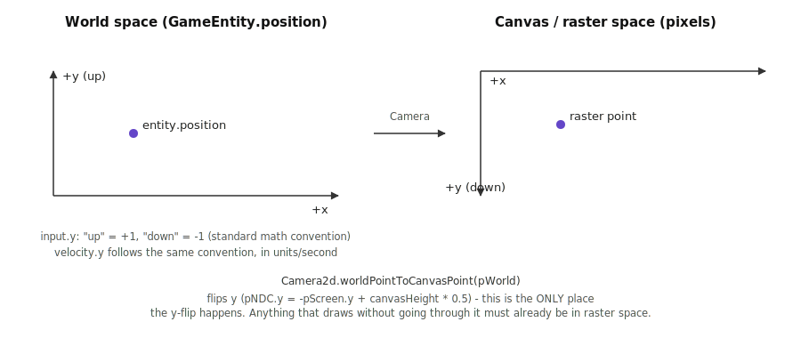
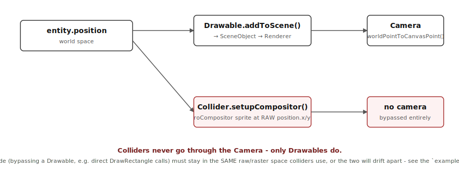

# Engine Internals

This is a deeper look at *how* BGE implements the concepts covered in
[Building a Game with BGE](/tutorials/game-engine-overview) - the coordinate systems in play, how drawing relates (and
doesn't relate) to collision, and how the renderer and collision system are actually built. Read
this when you're debugging something that doesn't behave the way the overview guide suggests it
should, or when you're writing code that draws directly to a `Renderer` instead of going through a
`Drawable`.

## Two coordinate spaces, and exactly one place they meet

`GameEntity.position` (and `velocity`, `rotation`) live in **world space**: standard math
convention, +y is up. `GameInput.onInput(input)` reports directional input in the same convention -
pressing "up" gives `y: 1`, "down" gives `y: -1`.

Everything a `roScreen`/`roBitmap`/`roCompositor` actually draws to is in **canvas/raster space**:
origin top-left, +y down, in pixels.

The flip between the two happens in exactly one place: `Camera.worldPointToCanvasPoint()`
(`Camera2d.bs` for the default 2D camera, `Camera3d.bs` for a perspective camera). Every
`Drawable` goes through this - which is *why* it's safe for game code to think entirely in
"+y is up" world-space terms and never worry about the flip.

## Colliders never go through the camera

This is the one piece of the coordinate-space story that catches people who write custom draw
code: **`Collider` doesn't call the camera at all.**

`Collider.setupCompositor()`/`adjustCompositorObject()` place the collider's `roSprite` directly at
`entity.position.x`/`.y` (plus its `offset`) - no camera, no projection, no y-flip. This is a
deliberate simplification (collision math would be considerably more expensive if it had to
account for camera rotation/perspective every frame), but it means:

- For a `GameEntity` that only ever moves via `velocity`/`position` and only ever draws through a
  `Drawable` - which is how [Building a Game with BGE](/tutorials/game-engine-overview) recommends
  building everything, and how every entity in `examples/asteroids` is built - this is invisible:
  the `Drawable` pipeline and the `Collider` pipeline agree because both start from the same
  `entity.position`, and the camera transform is a pure, order-preserving mapping from one
  consistent space to another. You get this guarantee for free; it's not something you have to
  reason about per entity.
- **Calling `Renderer.DrawRectangle()`/`DrawText()`/etc. directly - bypassing `Drawable` entirely -
  throws that guarantee away.** It's occasionally the right call (a HUD element, a debug overlay, a
  background grid with no collider of its own), but the moment that code's coordinates need to
  agree with a `Collider` anywhere in the same scene, direct drawing is the reason they might not:
  you're now responsible for keeping two independent draw paths in the same coordinate space by
  hand. Prefer a `Drawable` whenever what you're drawing has a collider, or could reasonably grow
  one later.

### Case study: `examples/snake`

`examples/snake` hit exactly this. `GridEntity.drawRectangleOnGrid()` (used by both `Snake` and
`Apple`) called `renderObj.worldPointToCanvasPoint()` before drawing, while `MainRoom.drawWalls()`
drew its wall rectangles directly with raw coordinates - and every collider in the scene (walls,
snake head, apple) was built from raw `entity.position`, with no camera involved. The example's
`main.bs` also had a `Camera3d` wired up (`use3d = true`, a leftover from an earlier "does this
work in 3D too?" experiment), so the mismatch was made worse by a full perspective projection
distorting where things rendered near the edges of the play field.

The fix had three independent parts, each worth recognizing as its own category of bug:

1. **Coordinate-space mismatch** - `GridEntity` was made to draw directly, the same way
   `drawWalls()` already did, removing the stray camera transform entirely. (The more idiomatic
   fix would be converting the grid squares to real `Drawable`s in the first place, so this class
   of bug can't recur - `examples/snake` predates that convention being written down and hasn't
   been rebuilt around it, but a new grid-based game would be better off starting there.)
2. **Collider-offset mismatch** - the snake head and apple are drawn top-left-anchored, but their
   colliders used `offset_y = 0` instead of `offset_y = grid` (see the offset explanation in
   [Building a Game with BGE](/tutorials/game-engine-overview)), putting the collider a full cell
   away from the drawn square.
3. **Inverted input** - `Snake.onInput` set `yDirection = input.y` directly, but since `gridY`
   increases *downward* on screen (no camera flip involved, per the above) while `input.y` follows
   the world-space "+y is up" convention, pressing "down" was moving the snake *up*. The fix was a
   one-line sign flip: `yDirection = -input.y`.

None of these three would have been caught by type-checking or `bslint` - they're all "the numbers
are individually valid, they just don't agree with each other" bugs, which is exactly what makes
coordinate-space mismatches worth understanding structurally rather than pattern-matching on.

## Renderer, SceneObjects, and draw modes

A `Renderer` doesn't draw `Drawable`s directly - a `Drawable.addToScene(renderer)` call registers
a `SceneObject` subclass (`SceneObjectImage`, `SceneObjectBillboard`, `SceneObjectLine`,
`SceneObjectPolygon`, `SceneObjectText`, `SceneObjectModel`), and the `Renderer` iterates those
each frame. Each `SceneObjectDrawMode` controls how an object reacts to camera rotation/perspective:

| Draw mode | Behavior |
| --- | --- |
| `matchCamera` | Follows the camera's rotation/perspective like a normal 3D object. |
| `directToCamera` | Always faces the camera (billboard), ignoring its own rotation. |
| `directScaled` | Like `directToCamera`, but also compensates scale for camera distance. |
| `oriented` / `orientedDrawBackFace` | Respects its own rotation in 3D, optionally drawing back faces. |
| `wireFrame` / `wireFrameDrawBackFace` | Outline-only rendering of the triangle mesh. |
| `solid` / `solidDrawBackFace` | Filled triangle rendering. |

This is what gives a fundamentally 2D-raster engine its pseudo-3D/billboard capability (see
`examples/3d`) - `examples/rendererTest` has a runnable demo per mode (`DemoList.bs`).

Two supporting pieces worth knowing about if you're touching rendering performance:

- **`TriangleCache`** caches rasterized triangle bitmaps - triangle drawing (`drawBitmapTriangleTo`,
  `drawPinnedCorners`) is comparatively expensive per call, since it checks out and rasterizes
  scratch bitmaps internally. Code that draws the same triangle-heavy shape every frame should
  render once into a cached bitmap and blit that, rather than redoing the full draw at 60fps -
  `examples/rendererTest/CornerPinGridTest.bs` is a worked example of this pattern (and of what
  happens without it: most of a 26-tile grid silently failed to render after the first few tiles).
- **`ScratchBitmapPool`** hands out reusable off-screen bitmaps for exactly this kind of
  intermediate rendering work, so it doesn't need to allocate a fresh `roBitmap` every frame.

## Collision, concretely

Each `Collider` (`CircleCollider`, `RectangleCollider`) wraps one `roSprite` on the `Game`'s shared
`roCompositor`. Every frame, `Game.processEntitiesCollisions()` calls
`roCompositor.CheckMultipleCollisions()` per entity's colliders and dispatches `onCollision(myCollider,
otherCollider, otherEntity)` for every hit - there's no manual AABB/circle-intersection math
anywhere in engine code. `Collider.memberFlags`/`collidableFlags` are the same bitflags as
`ifSprite.SetMemberFlags`/`SetCollidableFlags` - two colliders only register a hit if their flags
intersect, which is how you'd implement, say, "bullets hit enemies but not other bullets."

## Garbage collection and entity lifecycle

`Game` runs BrightScript's garbage collector on a timer (`secondsBetweenGarbageCollection`, default
10s) rather than every frame, since running it every frame would be wasteful. `GameEntity.isValid()`
just checks whether `id` has been set to `invalid` - `Delete()`/`invalidate()` doesn't immediately
free anything, it marks the entity so the *next* full pass skips it and the end-of-frame cleanup
removes it from `Game.Entities`/`sortedEntities`. This is why engine code re-checks
`isValidEntity()` after every callback (see the game loop diagram in
[Building a Game with BGE](/tutorials/game-engine-overview)) instead of trusting that an entity is still there once a callback
that could delete it has run.
