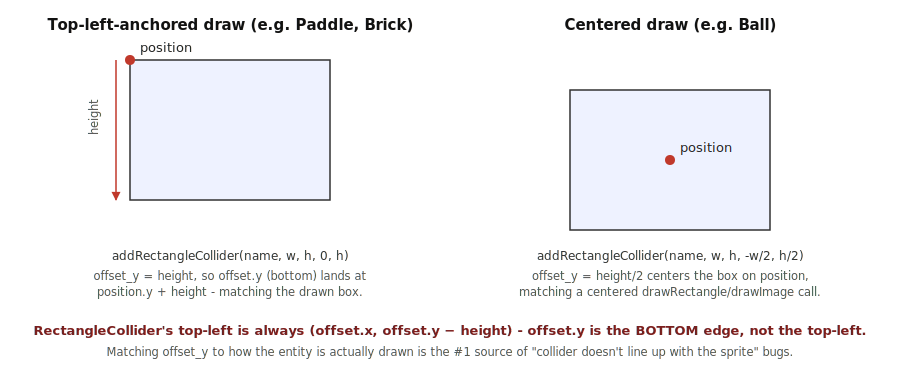
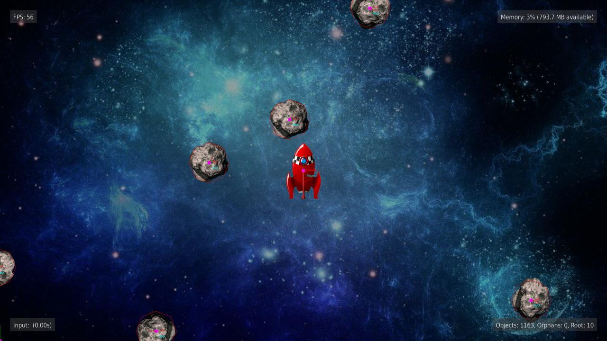
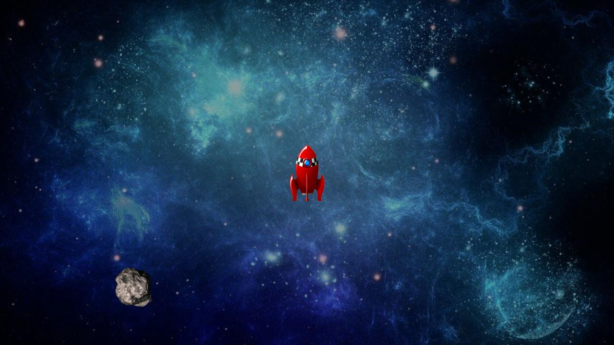
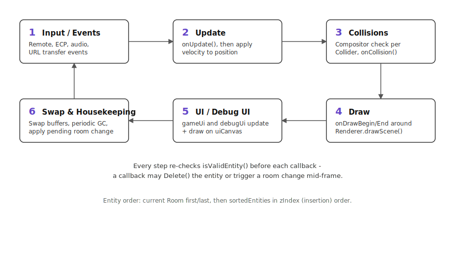

# Building a Game with BrighterScript Game Engine

This guide is for developers building a game *with* BGE - it walks through the pieces you'll
actually touch (`Game`, `Room`, `GameEntity`, `Drawable`, `Collider`) and how to put them together:
setting up a game, adding a sprite, moving it, and detecting collisions. For a deeper look at how
the engine implements these pieces internally, see [Engine Internals](/tutorials/engine-internals).

## What you're building on top of

BGE is an object-oriented 2D-first game engine for Roku channels, written in
[BrighterScript](https://github.com/rokucommunity/brighterscript) and distributed via
[ROPM](https://ropm.dev). Everything lives under the `BGE` namespace. The `examples/` folder in
the repo has full sample channels (`pong`, `breakout`, `asteroids`, `snake`, `3d`, `canvas`,
`pixels`, `quickstart`, `hybrid`) that are the fastest way to see any of this in action -
`quickstart` in particular is a minimal scaffold worth copying as a starting point for a new game.

## Architecture at a glance


| Piece | What it is |
| --- | --- |
| `Game` | The top-level engine object - one per app. Owns the main loop (`Play()`), the current `Room`, every other `GameEntity`, both canvases, and the asset registries (`Bitmaps`, `Sounds`, `Fonts`, `Models`, `Rooms`, `Interfaces`, `Statics`). |
| `Room` | A `GameEntity` subclass that represents "the current scene." Only one is active at a time; switching rooms via `Game.changeRoom()` destroys non-`persistent` entities. |
| `GameEntity` | The base class for anything in your game world - a player, an enemy, a bullet. Exposes lifecycle hooks (`onCreate`, `onUpdate`, `onCollision`, `onDrawBegin`/`onDrawEnd`, `onInput`, …) meant to be overridden, plus `position`/`velocity`/`rotation`/`scale`. |
| `Drawable` | **The recommended way to put anything on screen** - see below. A visual attachment on a `GameEntity` (`Image`, `Sprite`, `AnimatedImage`, `DrawableRectangle`, `DrawableLine`, `DrawablePolygon`, `DrawableText`, `Model3d`) that moves/rotates/scales with the entity automatically. |
| `Collider` | A `CircleCollider` or `RectangleCollider` attached to a `GameEntity`, wrapping a `roCompositor`/`roSprite` region. Collision checks run through the compositor, not manual math. |
| `Renderer` | Wraps an `ifDraw2D` surface (a `Canvas`'s bitmap). Owns the scene's `SceneObject`s and a `Camera`. There's one for the game canvas and a separate one for the UI canvas. |
| `Canvas` | Pairs a bitmap with a `Renderer` and scale/offset. `Game` composites the game canvas and UI canvas to the physical `roScreen` independently each frame, so UI can stay crisp regardless of game-canvas scaling. |
| `UiContainer` / `UiWidget` | A small retained-mode widget tree (`Label`, `Style`, `Alignment`) drawn to its own canvas layer above the game world. `Game.gameUi` and `Game.debugUi` are the two top-level containers. |

**Always draw through a `Drawable`, not by calling `Renderer.Draw*()` yourself.**
`examples/asteroids` is worth reading end to end as a reference for doing this consistently -
every entity (`Player`, `Rock`, `Bullet`) is built entirely from `addImage()` +
`addCircleCollider()` in `onCreate`, with no direct `Renderer` calls anywhere in gameplay code.
Beyond being less code, it's what keeps a `Drawable`'s visual position and its `Collider`'s
collision position guaranteed to agree - see
[why that guarantee exists](/tutorials/engine-internals#colliders-never-go-through-the-camera) if
you're curious about the mechanism.

## Setting up a game

Every BGE app follows the same shape: create a `Game`, define at least one `Room`, switch to it,
then start the main loop.

```
sub Main()
  game = new BGE.Game(1280, 720) ' canvas size
  game.fitCanvasToScreen()
  game.loadBitmap("player", "pkg:/sprites/player.png")

  firstRoom = new MainRoom(game)
  game.defineRoom(firstRoom)
  game.changeRoom(firstRoom.name)

  game.play() ' runs until Game.End() is called
end sub
```

`Room` is just a `GameEntity` subclass - a natural place to spawn your initial entities in
`onCreate` and to route global input (pause, quit) in `onInput`:

```
class MainRoom extends BGE.Room
  sub new(game as BGE.Game)
    super(game)
    m.name = "MainRoom"
  end sub

  override sub onCreate(args as roAssociativeArray)
    m.game.addEntity(new Player(m.game))
  end sub

  override sub onInput(input as BGE.GameInput)
    if input.isButton("back")
      m.game.End()
    end if
  end sub
end class
```

## Adding a sprite to an entity

A `GameEntity` doesn't draw anything on its own - you attach a `Drawable` to it, almost always from
`onCreate`. `addImage()` is the common case: load a bitmap once (`Game.loadBitmap`), wrap it in an
`roRegion`, and hand that to `addImage()`.

```
class Player extends BGE.GameEntity
  width = 0
  height = 0

  sub new(game as BGE.Game)
    super(game)
    m.name = "Player"
  end sub

  override sub onCreate(args as roAssociativeArray)
    bitmap = m.game.getBitmap("player")
    m.width = bitmap.GetWidth()
    m.height = bitmap.GetHeight()

    ' SetPreTranslation centers the image on m.position instead of drawing
    ' from its top-left corner - the usual choice for a player/enemy/bullet
    region = CreateObject("roRegion", bitmap, 0, 0, m.width, m.height)
    region.SetPreTranslation(-m.width / 2, -m.height / 2)
    m.addImage("sprite", region)
  end sub
end class
```

A few other `Drawable` types for common cases, all added the same way (`m.addWhatever(name, ...)`
in `onCreate`):

- `addSprite(name, spriteSheet, cellWidth, cellHeight)` - a `Sprite` for a single frame cut out of
  a larger sprite sheet.
- `addAnimatedImage(name, regions)` - cycles through an array of `roRegion`s for a walk/idle/attack
  animation; see `examples/pixels`.
- `addDrawableRectangle`/`addDrawableLine`/`addDrawablePolygon`/`addDrawableText` - simple vector
  shapes and text, useful for placeholder art or UI-adjacent visuals in the game world.

## Moving an entity

Every `GameEntity` has a `position` and a `velocity` (both `BGE.Math.Vector`s). Set `velocity` from
`onInput` (or `onUpdate`, for AI/scripted movement) and the engine applies it to `position`
automatically every frame - you don't move entities by hand.

```
override sub onInput(input as BGE.GameInput)
  ' input.x/input.y are -1/0/1 depending on which direction is held
  m.velocity.x = input.x * 300
  m.velocity.y = input.y * 300
end sub
```

`velocity` is in **units per second** (not "units per frame" - a value in the hundreds, like above,
is completely normal). For movement that isn't a direct response to input - drifting, easing
toward a target, gravity - do the math in `onUpdate(deltaTime)` instead, using `deltaTime` (seconds
since last frame) the same way:

```
override sub onUpdate(deltaTime as float)
  m.velocity.y += m.gravity * deltaTime
end sub
```

`rotation` and `scale` work the same way as plain fields you set directly (there's no
"rotational velocity" convenience - update `rotation` yourself in `onUpdate` if you want continuous
spin).

## Colliders and collisions

Attach a collider the same way you attach a `Drawable` - `addCircleCollider`/
`addRectangleCollider` in `onCreate` - then override `onCollision` to react when it hits another
entity's collider:

```
override sub onCreate(args as roAssociativeArray)
  ' ...set up the Drawable as above, then...
  m.addCircleCollider("body", m.width / 2)
end sub

override sub onCollision(myCollider as BGE.Collider, otherCollider as BGE.Collider, otherEntity as BGE.GameEntity)
  if otherEntity.name = "Rock"
    m.game.destroyEntity(m)
  end if
end sub
```

For a circle collider centered on the entity (the common case, matching a centered `Drawable` like
the `Player` example above), the radius is all you need. `RectangleCollider` takes an `offset_x`/
`offset_y` too, and getting that offset right depends on how the entity is drawn:



`addRectangleCollider(name, width, height, offset_x, offset_y)` places the rectangle's **top-left**
corner at `(offset_x, offset_y - height)` - so `offset_y` is the *bottom* edge, one full `height`
below the top-left, not the top-left itself. In practice:

- **Top-left-anchored** (drawn at `position`, growing down/right - a `Paddle` or a `Brick`): use
  `offset_y = height`.
- **Centered** (drawn with `SetPreTranslation`, like the `Player` above): use
  `offset_y = height / 2`.

If a collider ever looks like it's registering at the wrong spot, `Game.debugDrawColliders(true)`
draws every collider's actual bounds directly on screen, alongside each entity's name and position
- almost always faster than guessing from the offset math:



Compare that to the same scene with debug drawing off:



## The game loop

`Game.Play()` runs one main loop. Every frame goes through six steps, always in this order:



A few things fall out of this that matter in practice:

- **Entity order**: the current `Room` is always processed first and last; everything else
  (`sortedEntities`) runs in `zIndex` (insertion) order in between.
- **Callbacks can invalidate their own entity.** A callback might call `Delete()` on itself, or
  trigger a room change. That's why the engine re-checks `isValidEntity()` before every single
  callback - if you write code that processes many entities in a loop (rare for game code, common
  for engine-level tooling), follow the same pattern.
- **Room changes are deferred to end-of-frame.** Calling `Game.changeRoom()` mid-frame doesn't
  swap the room immediately - it's applied after the draw/swap step, once the current frame is
  fully done with the old room.

## Debugging tools worth knowing early

- `Game.debugDrawColliders(true)` / `Game.debugDrawEntityDetails(true)` / `Game.debugShowUi(true)`
  - toggle these from an `onInput` handler (most examples bind them to the `options` remote
    button) to get the collider-outline view above, plus per-entity name/position labels.
- `Game.getDebugUI().addChild(new BGE.Debug.FpsDisplay(game))` and
  `BGE.Debug.InputDisplay`/`MemoryDisplay`/`GarbageCollectorDisplay` are ready-made debug widgets -
  every example wires up at least the FPS display in `main.bs`.
- `examples/rendererTest` is a menu-driven suite of `Renderer` demos built *without* `Game`/`Room`
  at all - useful for trying out a specific rendering capability (draw modes, triangle warping,
  camera projection) in isolation before wiring it into a real game.

## Where to go next

- Skim `examples/quickstart` for the smallest possible working game.
- Read `examples/asteroids` as the reference for building entities entirely out of
  `Drawable`s/`Collider`s, with no direct `Renderer` calls in gameplay code.
- Read `examples/breakout` or `examples/pong` for a complete, small, real game with comments
  explaining the collider-offset and velocity choices made for each entity.
- See [Engine Internals](/tutorials/engine-internals) for how the renderer, camera, and collision
  system fit together under the hood - useful once you're debugging something that doesn't behave
  like the docs above suggest it should.
